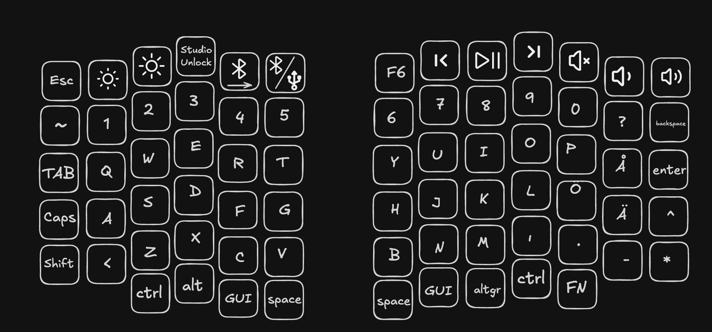
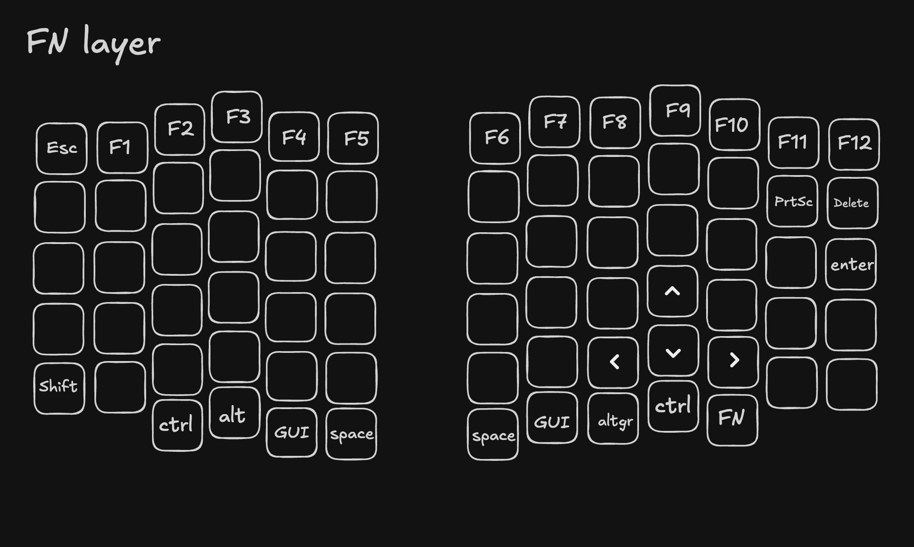

# Nordic split software

## What is Nordic split

Nordic split is a split keyboard created by [NoseFa](https://github.com/NoseFa). It was created as a part of [Hack club Fallout](https://fallout.hackclub.com). The hardware side / main repo is available [Github SplitKB](https://github.com/NoseFa/splitkb).

Here is a 3D render of the keyboard.

## What does this repo cover ?

This repo covers the software side of this project. This was created from the [ZMK template](https://zmk.dev/docs/hardware-integration/new-shield). The keyboard is wireless and runs ZMK software. The included keymap includes two layers a function layer and a QWERTY layer. You can see the keymap visually here.

As you can probably see the keymap is based on a nordic layout with some maybe weird decisions by key spots by me. This is also my first split and ortholinear keyboard so it might take some time for this keymap to be actually good. The clear keys on the function layer are made to pass inputs back to the default layer.There are also two extra layers just made for if people want to create custom keymaps in [ZMK studio](https://zmk.studio/). If you want to install the software it's available as a .uf2 file in the [Firmware folder](./firmware/). Remember that there are two different files for the controllers. One for the [left](./firmware/nordic1_left-nice_nano_v2-zmk.uf2) and one for the [right](./firmware/nordic1_right-nice_nano_v2-zmk.uf2) halve. Even tho the software is made for a Nice!Nano board it will work with the board in the [BOM.csv](https://github.com/NoseFa/splitkb/blob/main/BOM.csv) of the main project.

## ZMK studio

ZMK studio is a tool provided by ZMK and for which I have added support in the firmware provided. You can use the easy to use GUI to change the keymap. The changes can be made even while the board is still connected to your computer and doesn't require reflashing. I have added 2 extra layers for which you can use for what ever you like. These have been left empty for now and should be configured by what you want. If you want to switch from the nordic keymap thats also made easier by ZMK studio and not having to flash the firmware again.

## Installation / flashing the firmware

For installing you can grab the .uf2 files from the software folder. You can also edit the config files if you want to modify them and make your own .uf2 files. You can enter the flashing mode of the ProMicro by shorting the Rst(Reset) and GND(Ground) pins for 0,5s while connecting to your computer and the controller should show up as a Nice!Nano storgae media device. You can drag and drop in the .uf2 file on it and it should install it. You have seperate firmware files for each side ([`nordic1_left-nice_nano_v2-zmk.uf2`](./firmware/nordic1_left-nice_nano_v2-zmk.uf2) and [`nordic1_right-nice_nano_v2-zmk.uf2`](./firmware/nordic1_right-nice_nano_v2-zmk.uf2)) check that you have the correct one before you flash it. The sides have different layouts and settings so this is important. After flashing them they should boot into the ZMK firmware and they should link together automatically through their paring process. See [the ZMK troubleshooting guide](https://zmk.dev/docs/troubleshooting/connection-issues). The keyboard should also become visible as a bluetooth device you can connect to. Keep in mind that only one device will show up and not both halves seperately.
